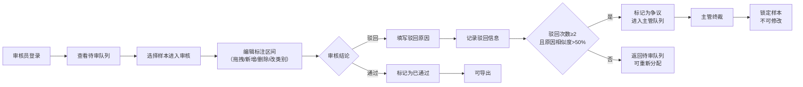

## 1. 产品概述
手语动作序列标注审核工作台，用于人工审核 AI 模型预标注的手语视频序列标注结果，提升标注质量和数据准确性。目标用户为标注审核员和质检主管，通过高效的审核流程和争议解决机制，确保手语标注数据集的高质量。

## 2. 核心功能

### 2.1 用户角色
| 角色 | 登录方式 | 核心权限 |
|------|----------|----------|
| 审核员 | 账号登录（模拟） | 查看待审队列、审核标注、通过/驳回样本、填写驳回原因 |
| 主管 | 账号登录（模拟） | 审核员所有权限 + 争议样本终裁、导出标注数据、查看统计 |

### 2.2 功能模块
1. **登录页**：角色选择登录，模拟身份认证
2. **审核员工作台**：待审队列、审核详情页、标注编辑
3. **主管工作台**：争议队列、终裁页面、数据导出
4. **通用组件**：可拖拽时间轴、类别选择器、驳回原因输入

### 2.3 页面详情
| 页面名称 | 模块名称 | 功能描述 |
|----------|----------|----------|
| 登录页 | 角色选择 | 选择审核员/主管身份进入系统 |
| 审核员队列页 | 样本列表 | 按优先级展示待审样本（争议优先→待审最久优先） |
| 审核详情页 | 时间轴标注 | 可视化展示标注区间，支持拖拽调整起止帧 |
| 审核详情页 | 区间管理 | 新增区间、删除区间、修改动作类别 |
| 审核详情页 | 审核操作 | 通过样本 / 驳回样本（必填原因） |
| 主管争议队列页 | 争议列表 | 展示争议样本，显示驳回历史和相似度 |
| 主管终裁页 | 终裁操作 | 最终裁定标注结果，裁定后锁定不可修改 |
| 导出页 | 数据导出 | 按日期范围导出已通过样本的修订后 JSON |

## 3. 核心流程

### 审核流程

### 争议终裁流程

## 4. 用户界面设计

### 4.1 设计风格
- **主色调**：深靛蓝 `#1e3a5f` 作为主色，体现专业稳重
- **辅助色**：琥珀橙 `#f59e0b` 标记争议状态，翠绿 `#10b981` 标记通过，玫红 `#ef4444` 标记驳回
- **按钮风格**：直角微圆角（2px），悬停有轻微上浮阴影，点击有按压反馈
- **字体**：中文使用 "PingFang SC" / "Microsoft YaHei"，数字和英文使用 "JetBrains Mono" 等宽字体
- **布局风格**：三栏式布局（左侧导航 + 中间主内容 + 右侧信息面板），卡片式模块
- **图标风格**：线性简约图标，使用 Lucide React 图标库

### 4.2 页面设计概述
| 页面名称 | 模块名称 | UI 元素 |
|----------|----------|---------|
| 登录页 | 角色选择 | 大卡片式角色选择，悬停动效，深色渐变背景 |
| 审核员队列页 | 样本列表 | 表格 + 优先级标签，行悬停高亮，快捷操作按钮 |
| 审核详情页 | 时间轴 | 顶部时间轴标尺，标注区间块可拖拽，边缘拖拽调整长度 |
| 审核详情页 | 区间列表 | 可折叠区间卡片，类别下拉选择，删除按钮 |
| 审核详情页 | 操作栏 | 底部固定操作栏，通过/驳回按钮，驳回模态框 |
| 主管争议队列页 | 争议列表 | 显示相似度进度条，驳回原因对比面板 |
| 导出页 | 导出面板 | 日期选择器，导出预览，下载按钮 |

### 4.3 响应式
- 桌面端优先设计，最小支持宽度 1280px
- 时间轴组件自适应宽度，支持横向滚动
- 操作按钮在小屏幕下堆叠显示

### 4.4 交互细节
- 时间轴区间拖拽：拖拽时显示半透明预览，释放后吸附到整帧
- 区间边缘调整：鼠标悬停边缘显示调整光标，拖拽时实时显示起止帧号
- 驳回原因输入：实时词数统计，提交前验证非空
- 状态变更：样本状态变化时有 0.3s 的高亮闪烁反馈
- 页面切换：淡入淡出过渡动画
