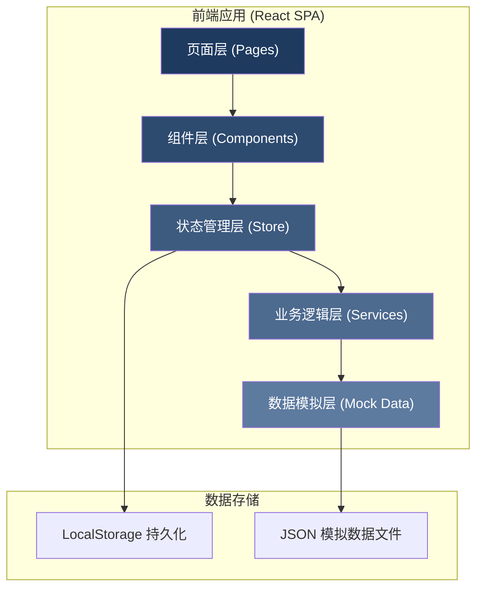
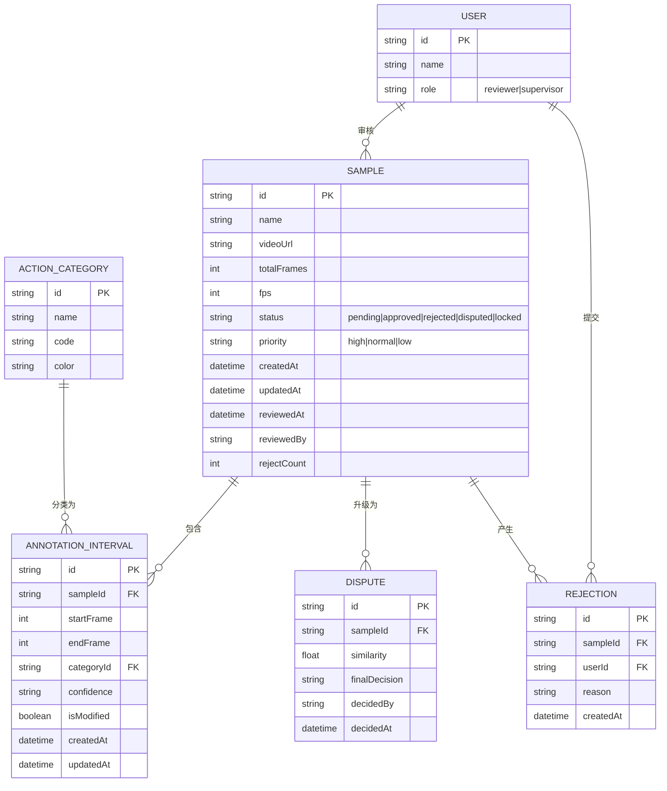

## 1. 架构设计



## 2. 技术描述

- **前端框架**: React@18 + TypeScript@5 + Vite@5
- **样式方案**: TailwindCSS@3 + CSS Variables
- **状态管理**: Zustand (轻量级状态管理)
- **路由**: React Router@6
- **图标库**: Lucide React
- **后端**: 无后端，使用 JSON 文件模拟数据 + LocalStorage 持久化
- **构建工具**: Vite
- **代码规范**: ESLint + Prettier

## 3. 路由定义

| 路由路径 | 页面用途 | 访问角色 |
|----------|----------|----------|
| `/login` | 登录页，角色选择 | 所有 |
| `/reviewer/queue` | 审核员待审队列 | 审核员 |
| `/reviewer/sample/:id` | 审核详情页 | 审核员 |
| `/supervisor/disputes` | 主管争议队列 | 主管 |
| `/supervisor/sample/:id` | 主管终裁页 | 主管 |
| `/supervisor/export` | 数据导出页 | 主管 |

## 4. 数据模型

### 4.1 ER 图



### 4.2 TypeScript 类型定义

```typescript
// 用户角色
type UserRole = 'reviewer' | 'supervisor';

interface User {
  id: string;
  name: string;
  role: UserRole;
}

// 样本状态
type SampleStatus = 'pending' | 'approved' | 'rejected' | 'disputed' | 'locked';
type SamplePriority = 'high' | 'normal' | 'low';

interface Sample {
  id: string;
  name: string;
  videoUrl: string;
  totalFrames: number;
  fps: number;
  status: SampleStatus;
  priority: SamplePriority;
  createdAt: string;
  updatedAt: string;
  reviewedAt?: string;
  reviewedBy?: string;
  rejectCount: number;
  rejections: Rejection[];
  intervals: AnnotationInterval[];
  dispute?: Dispute;
}

interface AnnotationInterval {
  id: string;
  sampleId: string;
  startFrame: number;
  endFrame: number;
  categoryId: string;
  confidence: number;
  isModified: boolean;
  createdAt: string;
  updatedAt: string;
}

interface ActionCategory {
  id: string;
  name: string;
  code: string;
  color: string;
}

interface Rejection {
  id: string;
  sampleId: string;
  userId: string;
  userName: string;
  reason: string;
  createdAt: string;
}

interface Dispute {
  id: string;
  sampleId: string;
  similarity: number;
  finalDecision?: 'approved' | 'rejected';
  decidedBy?: string;
  decidedAt?: string;
}
```

## 5. 核心业务逻辑

### 5.1 队列优先级排序算法
```
优先级权重 = 争议标记(1000) + 等待时间(小时) * 优先级系数
- 争议样本: 权重 +1000
- 高优先级: 等待时间 * 3
- 普通优先级: 等待时间 * 1
- 低优先级: 等待时间 * 0.5
```

### 5.2 驳回原因相似度计算
```
分词: 将驳回原因按中文分词（简单按空格和标点分割）
词集合: 去重得到词集合 A 和 B
相似度 = |A ∩ B| / |A ∪ B| > 0.5 则判定为相似
```

### 5.3 时间轴拖拽逻辑
- 区间整体拖拽: 保持区间长度不变，同步更新 startFrame 和 endFrame
- 左边缘拖拽: 只调整 startFrame，确保 start < end
- 右边缘拖拽: 只调整 endFrame，确保 end > start
- 吸附: 所有调整自动吸附到整帧

## 6. 项目目录结构

```
src/
├── assets/              # 静态资源
├── components/          # 通用组件
│   ├── Timeline/        # 可拖拽时间轴组件
│   ├── Layout/          # 布局组件
│   ├── Modal/           # 模态框组件
│   └── ui/              # 基础 UI 组件
├── pages/               # 页面组件
│   ├── Login.tsx
│   ├── reviewer/
│   │   ├── Queue.tsx
│   │   └── SampleDetail.tsx
│   └── supervisor/
│       ├── Disputes.tsx
│       ├── FinalDecision.tsx
│       └── Export.tsx
├── store/               # 状态管理
│   ├── useAuthStore.ts
│   ├── useSampleStore.ts
│   └── useCategoryStore.ts
├── services/            # 业务逻辑
│   ├── sampleService.ts
│   ├── similarityService.ts
│   └── exportService.ts
├── data/                # Mock 数据
│   ├── samples.json
│   ├── categories.json
│   └── users.json
├── types/               # TypeScript 类型定义
│   └── index.ts
├── utils/               # 工具函数
│   ├── time.ts
│   └── storage.ts
├── App.tsx
├── main.tsx
└── index.css
```

## 7. 状态管理设计

### useAuthStore
- currentUser: 当前登录用户
- login(role): 模拟登录
- logout(): 退出登录

### useSampleStore
- samples: 所有样本列表
- currentSample: 当前审核样本
- getReviewerQueue(): 获取审核员待审队列（排序后）
- getDisputeQueue(): 获取主管争议队列
- updateInterval(): 更新标注区间
- addInterval(): 新增区间
- deleteInterval(): 删除区间
- approveSample(): 通过样本
- rejectSample(): 驳回样本（检查是否升级为争议）
- finalDecision(): 主管终裁

### useCategoryStore
- categories: 动作类别列表
- getCategoryById(): 根据 ID 获取类别
